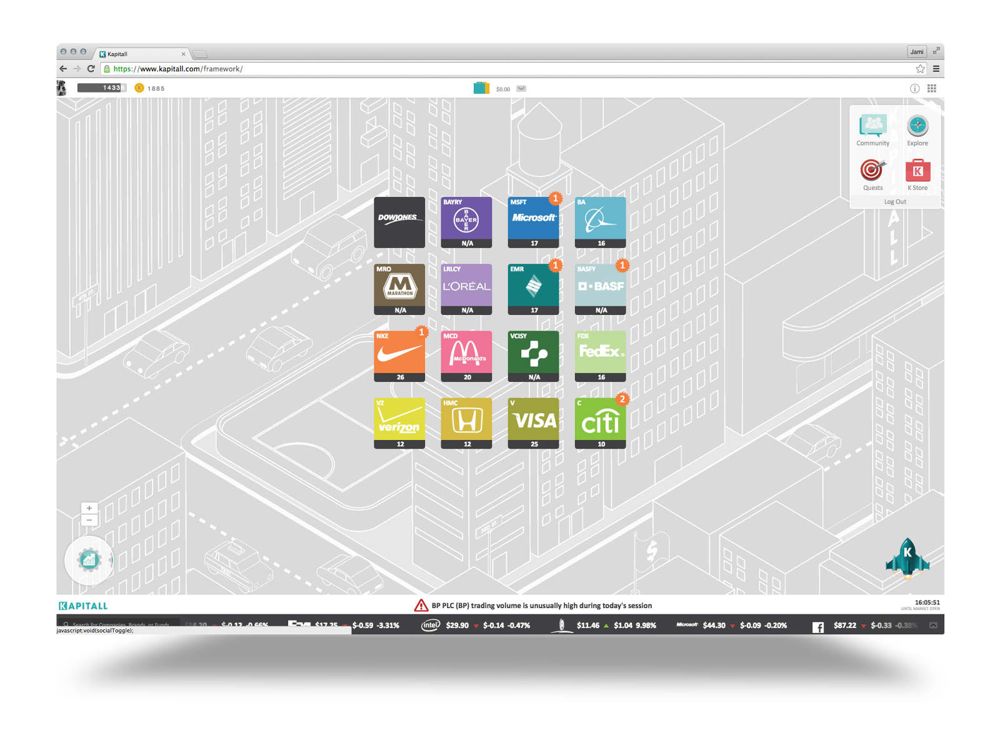

Kapitall was a financial trading platform designed to appeal to millennials.
Having been founded around 2008, it was a typical "web 2.0" product, and was focused around what they called "drag and drop trading."
The primary interface was a desktop-style UI with stocks and ETFs that could be dragged around like files and organized like folders.

I worked on both the frontend and backend.
The frontend was built with a completely custom framework powered by jQuery, as was common in that era.
The backend was Groovy (a variant of Java) and SQL, and hosted on DigitalOcean.

